## Table of Contents
- [Preface](#preface)
- [Overview](#overview)
- [System Design](#system-design)
- [Flow Design](#flow-diagram)
- [Sequence Design](#sequence-flow)
- [Data Quality](#dq-framework)
- [Deployment Model](#deployment-model)

## Preface 

The design scope here covers areas that are either being reengineered or/and extended to enhance the current functionality of several systems at spike up, most noticeably airbyte,airflow and snowflake. A brand new system for operational management is being introduced, more on this below.  

There are 3 parts/modules to Phase-1 release. The High Level Design here will try and address the specifics of each of the modules

On the immediate need, Module 1, consists of the following sub-modules -- please see the project plan on details of Module 1 and its parts
 
- 1.1: `Stage-1: Raw Zone  Re-Engineered Pipelines = Casino Operator Source --> AWS S3-Files`
- 1.2: `Stage-2: Raw Zone S3 Files Black Box DQ Checks`
- 1.3 `RAW Data S3 Files to Snowflake Raw Zone Linkage`

## Overview

#### Core Systems as part of overall platform

- AirByte  
    * Align connector development around low code framework like  Airbyte YAML CDK
    * A path to decommission current source connectors that have significant code foot print 
    * A second level of generalization around YAML connectors on common operations like custom authentication, specialized request construction 
      and wide format response parsing
    * Component registry build and deployment for reusability

- AirFlow
    * Re-engineered DAG's to improve system utilization by collating and parallelizing platform operations 
    * Stage - I Data Quality inspection and control flow of Airflow jobs
    * Better Diagnostics and Error reporting of flows on AirFlow

- Op Control Center

    * Decouple Business Op activity from airbyte connector framework 
    * Data Source Management --  new connections, repair or fix connectivity and maintenance of source data assets 
    * Dedicated OP control center with near realtime monitoring and activity logs

- S3 RAW Zone

    * All sourced datasets will be stored on AWS S3 as parquet files
    * Sources extracted will be partitioned by time and/or with other context appropriate for optimal downstream consumption

- SnowFlake

    * Externalize Raw Sources to cheaper alternative like S3
    * Phase-I, source datasets will appear as external tables inside SnowFlake
    * Phase II and beyond will engineer Snowflake for optimal compute and storage

## System Design
    
### AirByte Changes

- The components colored in green are areas where design and behavior of the existing system will be altered  
- The Airbyte YML CDK extensions are python modules that abstract logic based on needed behavior for a given platform
    * Custom Authenticator ; When authentication falls outside basic and simple token model
    * Custom Requester ; Requires packing pre-computed payloads that have to be dynamically formed
    * Custom Record Extractor ; When response parsing is warranted, for example converting xml to json payload
    * With the ability to enhance behavior as needed

- The Airbyte YML CDK extensions on Destination connectors is optional, may be needed to inject Data Quality Checks, will be refined as part DQ-Framework Design

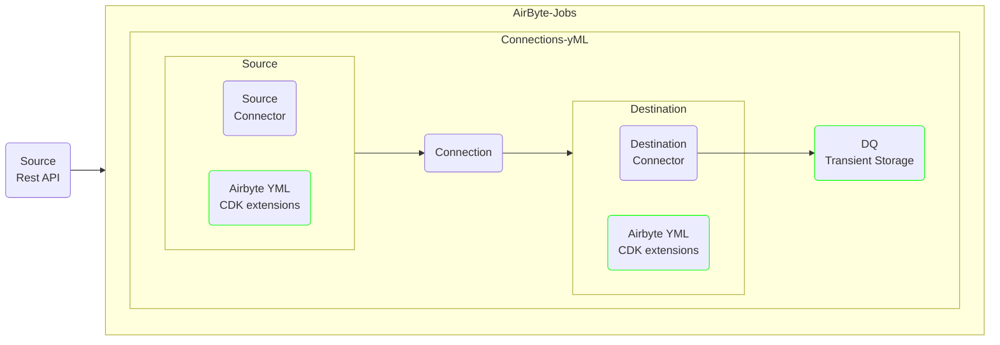
### AirFlow Changes

- The components colored in green are areas where design and behavior of the existing system may be altered 
- The AWS s3 buckets will have a logical structure where each platform will sit under a hierarchal root  
- Under the Platform hierarchical root, each unique data-stream will be written by date and time as sourced
- The hierarchy goes somewhat like  `"Platform_Name > "Operator Account" > "Stream_Name" > "YYYY" > "MM" > "DD" > {yyyy}_{mm}_{dd}_{H24ssms}.parquet`,
- At the very top, each platform will have a designated bucket 
- User/ Admin will be able to view and  drill down the folders in the hierarchy
- The S3 is an object store, though AWS S3 console gives users the ability to drill/navigate the folders, these are not actual folder rather the Key itself for that given object

##### Visual Map of S3 
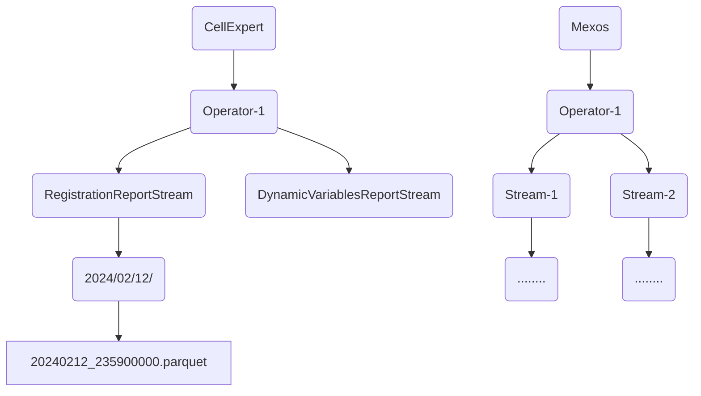
##### Typical Airflow Flow Control

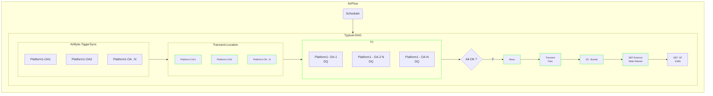
### SnowFlake Changes
- The components colored in green are areas where design and behavior of the existing system will be altered 
- For S3 bucket and file naming convention; please see section Airflow for the details
- Files in S3 don't appear automatically on External Tables in SnowFlake
- Simplest option is run an alter statement which refresh the external table meta data that has file listing 
- An elegant option is to set up AWS SQS [ Simple Queuing Service] that SF can subscribe to
- External Table will be partitioned based on year, month and date of the file or/and path through column expressions 
- External tables are likely to will be slow,i.e. relative to querying against tables with SF managed storage, this can be compensated thru materialized views if needed, the latency increase is small price to pay to have a de-coupled system
- S3 File format is open, Parquet being on top of the choice list , alternate formats that may be considered are json, csv in that order

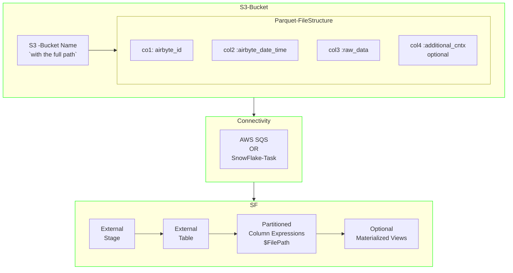

## Flow Diagram

####  OP Center Flow 

* UX -- Layer that facilitates Operational aspects of the system
* Service API -- Provides a nice decoupled architecture to interact with AirByte
* OpManager -- Backend Service as an AirFlow Job - core system functioning, logs maintenance, diagnostics,   measurements and metrics collection 
* Storage -- Layer that provides state-management for OPCenter

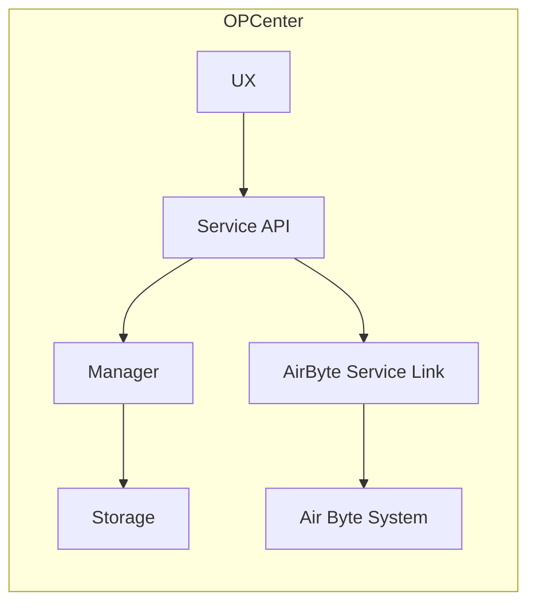
#### AirFlow Vendor Platform Specific Flow

* For a give source platform, the DAG's in airflow will be instrumental to control flow  of business data
* A DAG flow may contain more than 1 Airbyte connection, for example multiple operator accounts could constitute a successful run, in such case, a DAG will encapsulate the flow rules
* Data Quality Module will instrument all flow for quality aspect of source data -- low count, no count, failed responses etc
* Upon successful Flow Run data will flow into AWS S3 as Parquet Files
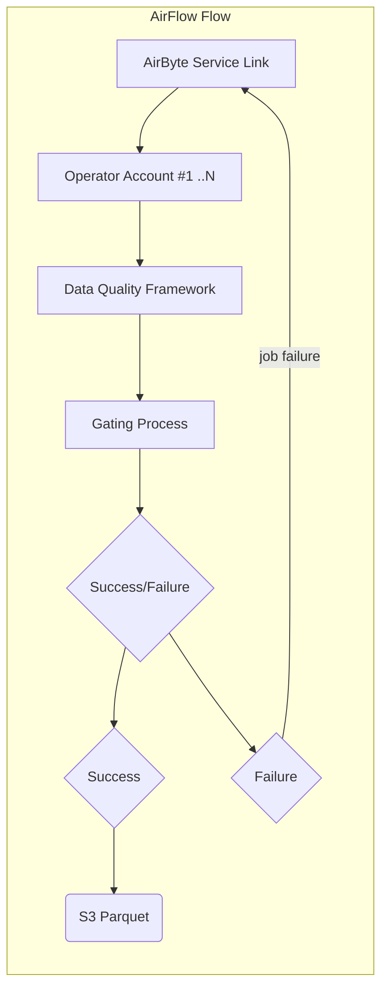
#### AirByte Platform Specific Flow

* AirByte will continue to be the platform of choice to configure  source  assets 
* AirByte connections will go thru Reusable Component Modules to strictly adhere to YML model based connections
* Airflow will "Always" host connections in manual model, external service will trigger designed connections
* Minimal to no interaction with AirByte for business , dev-ops will configuration , setup and  tuning 1 time
* Op-Center provides the interactivity with AirFlow for business users

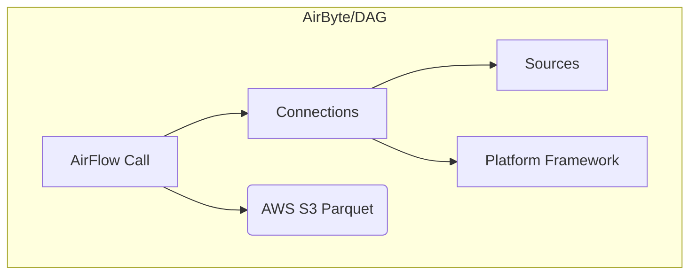
#### SnowFlake Medallion Flow

* SnowFlake Raw Zones will be externalized via SF External Tables
* Existing DBT Jobs should continue to Function as today 
* No Changes to downstream processes in Phase-I beyond RaW/Bronze

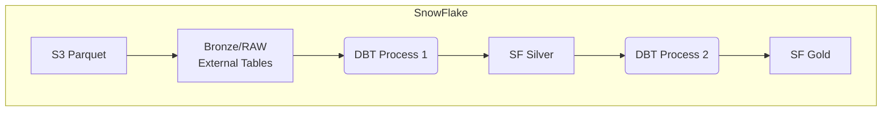

## Sequence Flow
- User Flow On Op-center
- Similar Flow is scheduled nightly in airbyte for OpCenter Manager to do similar connectivity checks
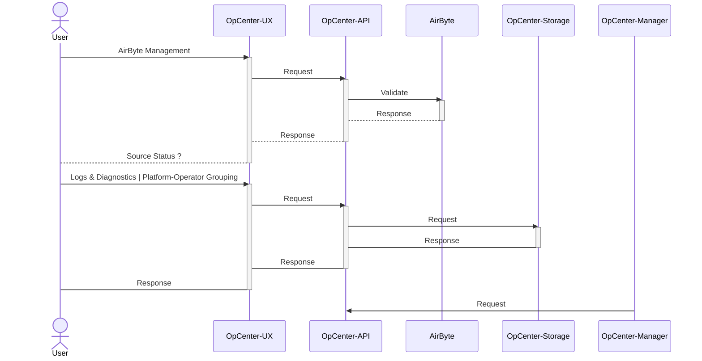
## DQ Framework
The Design around DQ is still evolving, at the very core the DQ subsystem is likely to contain the following modules

- Metrics Computation:
    - Profiles leverages Analyzers to analyze each column of a dataset.
    - Analyzers serve here as a foundational module that computes metrics for data profiling and validation at scale.
- Constraint Suggestion:
    - Specify rules for various groups of Analyzers to be run over a dataset to return back a collection of constraints suggested to run in a Verification Suite.
- Constraint Verification:
    - Perform data validation on a dataset with respect to various constraints set by you.
- Metrics Repository
    - Allows for persistence and tracking of DQ runs over time.  

##### Phase-I DQ Scope

- Black box DQ 
  * Record Count
  * Daily Minimums 
  * Daily variance from historical averages

##### DQ Component Model
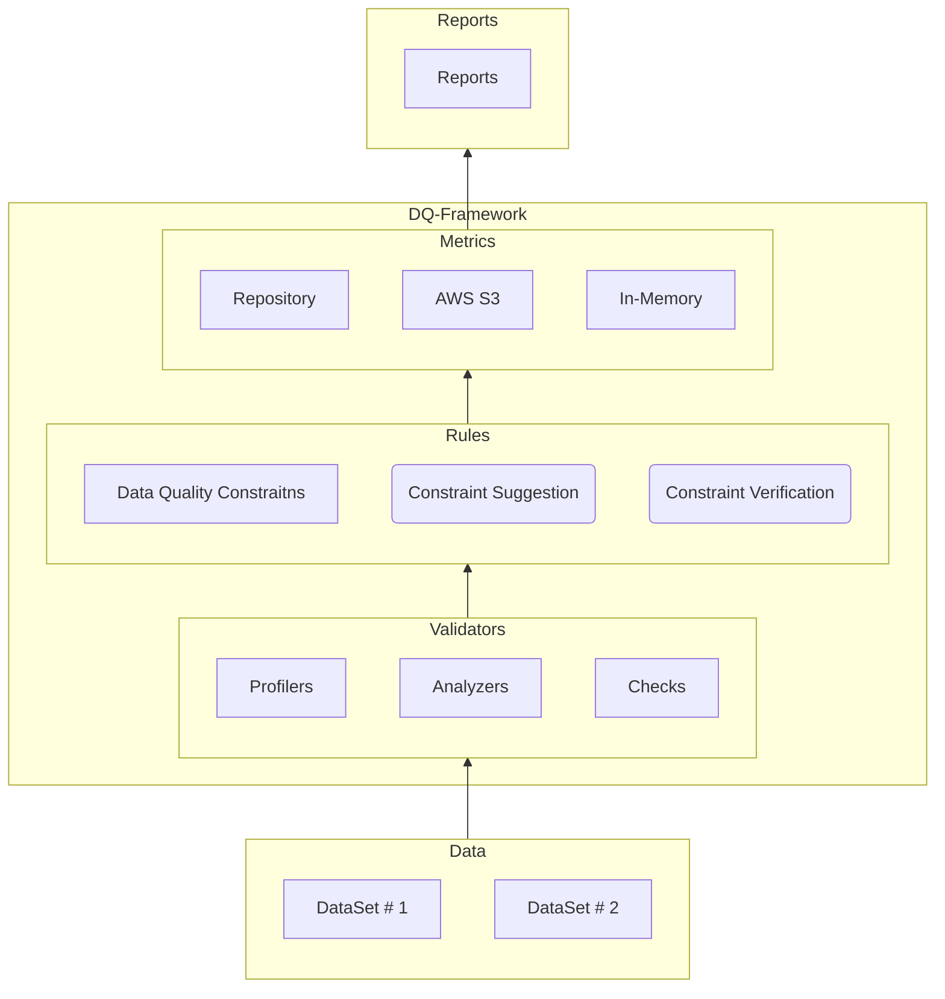

## Deployment Model

- Spike data platform will be baed on Kubernetes Stack
- Kubernetes will be designed in a way to set the node group to auto-scale
- Few Pods like ; AirFlow Scheduler; Op-Center Console will have persistent pods
- Pods will be short lived, the ones that are related to Airflow and AirByte Tasks

- An Abstract End Deployment Model

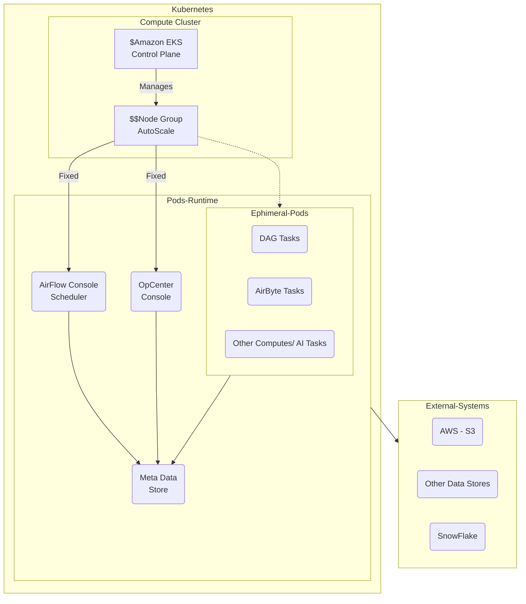
