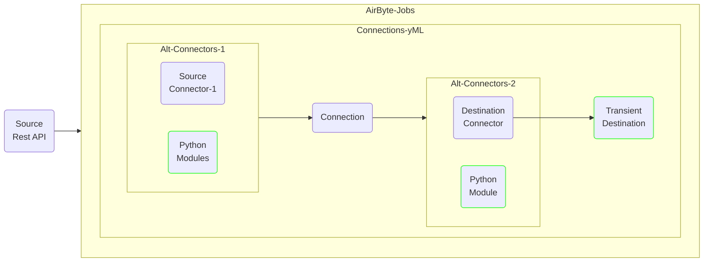
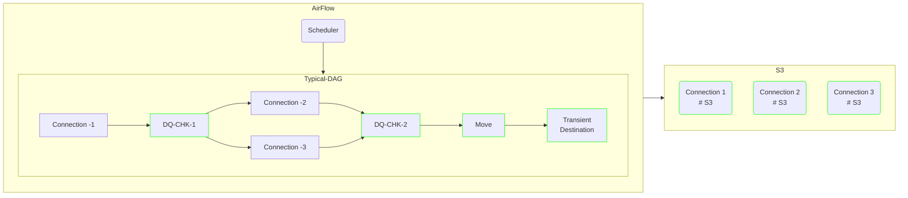
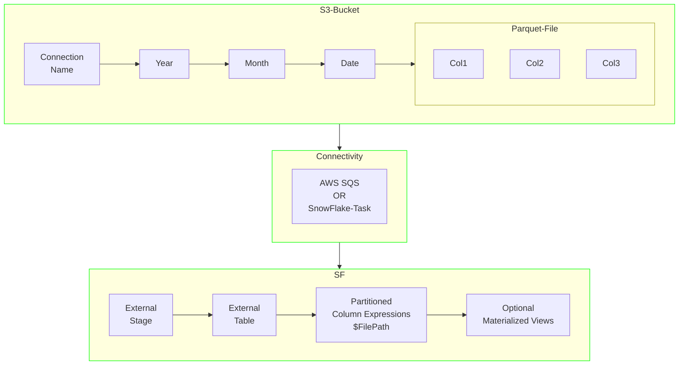
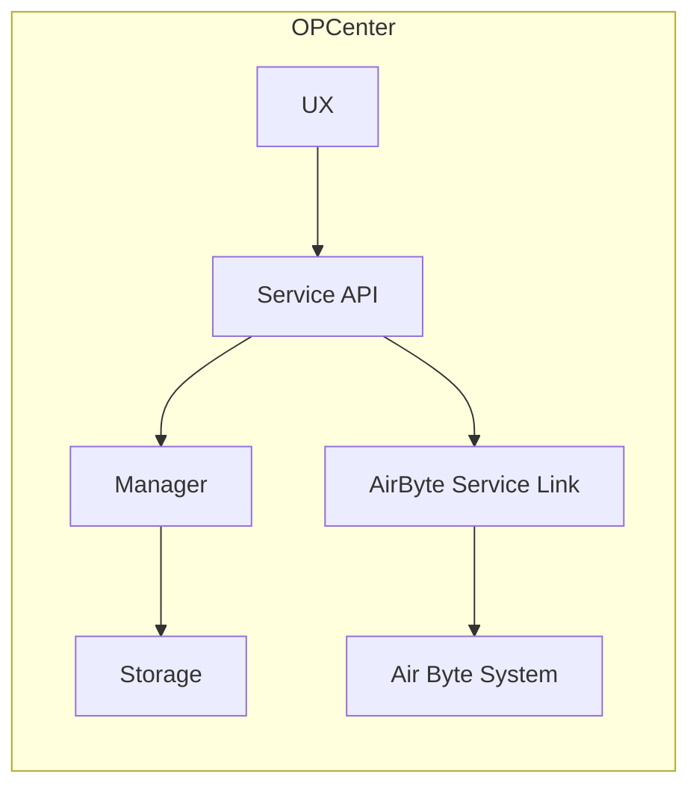
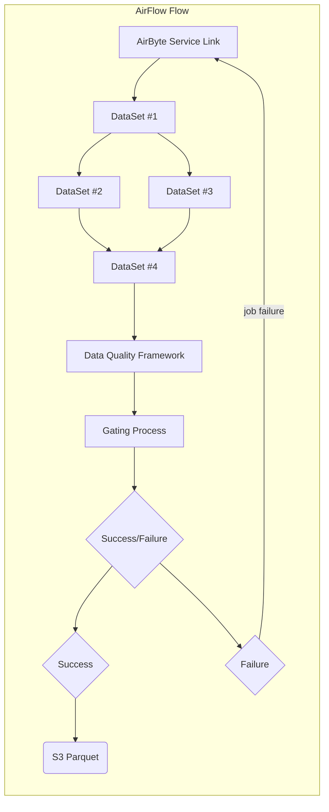
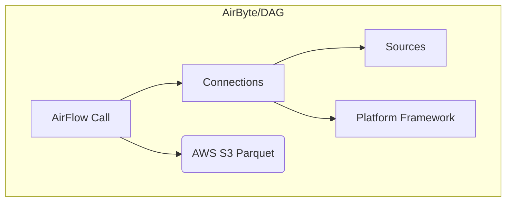
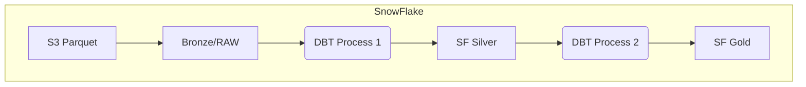
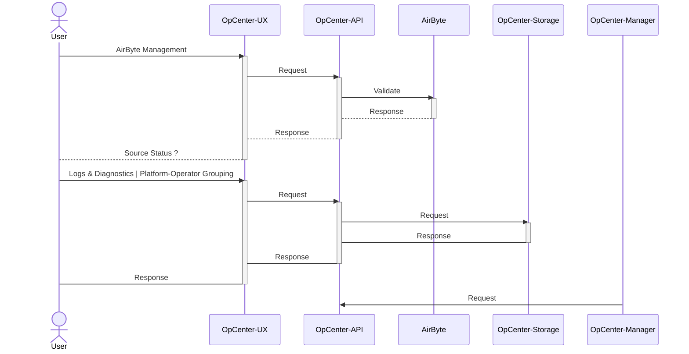
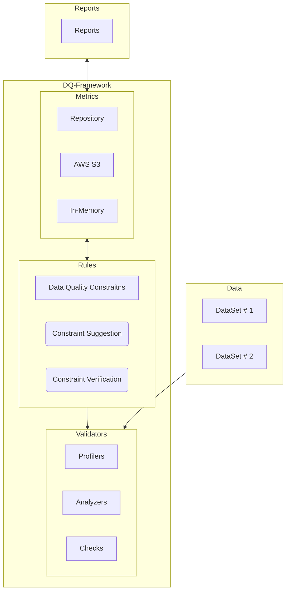
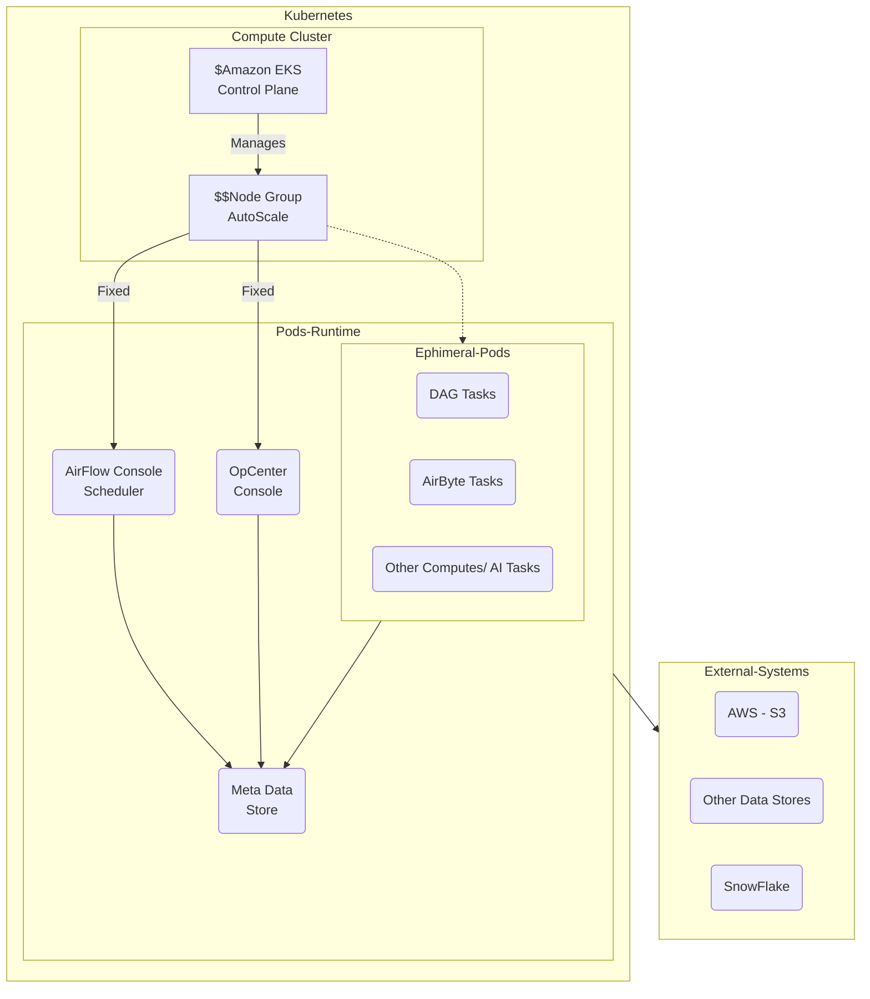

# Software Design 

The design here incorporates  areas that are either being reengineered or extended to enhance the current functionality of several systems  
at spike up, most noticably airbyte , airflow and snowflake and with a brand new system for operational mangement  

## Table of Contents

- [Overview](#overview)
- [System Architecture](#system-architecture)
- [Flow Diagram](#flow-diagram)
- [Sequence Diagram](#sequence-flow)
- [Data Quality](#dq-framework)
- [Deployment Model](#dq-model)
- [Contributing](#contributing)
- [License](#license)

## Overview

#### Core Systems as part of overall platform

- AirByte  
    * Align connector development around low code framework like  Airbyte YAML CDK
    * A path to decomission current source connectors that have significant code foot print 
    * A second level of generalization around YAML connectors on common operations like custom authnetication, specialized request construction  
      and wide format response parsing
    * Component registry build and deployment for resuability

- AirFlow
    * Re-engineered DAG's to improve system utilization by collating and parallelizing platform operations 
    * Stage - I Data Quality inspection and control flow of Airflow jobs
    * Better Diagnostics and Error reporting of flows on AirFlow

- Op Control Center

    * Decouple Business Op activity from airbyte connector framework 
    * Data Source Management --  new connections, reapir or fix connectivity and maintaince of source data assets 
    * Dedicated OP control center with near realtime monitoring and activity logs

- S3 RAW Zone

    * All sourced datasets will be stored on AWS S3 as parqauet files
    * Sources extracted will be partitioned by time and/or with other context appropriate for optimal downstream consumption

- SnowFlake

    * Externalize Raw Sources to cheaper alternative like S3
    * Phase-I, source datasets will appear as external tables inside SnowFlake
    * Phase II and beyond will engineer Snowflake for optimal compute and storage
 
    
### AirByte Changes

The components colored in green are areas where design and behavior of the existing system will be altered 

### AirFlow Changes

The components colored in green are areas where design and behavior of the existing system will be altered 

### SnowFlake Changes
The components colored in green are areas where design and behavior of the existing system will be altered 

## Flow Diagram

####  OP Center Flow 

* UX -- Layer that facilitates Operational aspects of the system
* Service API -- Provides a nice decoupled architecture to interact with AirByte
* OpManager -- Backend Service as an AirFlow Job - core system functioning, logs maintenance, diagnostics,   measurements and metrics collection 
* Storage -- Layer that provides state-management for OPCenter

#### AirFlow Vendor Plaform Specific Flow

* For a give source platform, the DAG's in airflow will be instrumental to control flow  of business data
* A DAG flow may contain more than 1 Airbyte connection, for exaple multiple operator accounts could constitute a successful run, in such case, a DAG will encapsulate the flow rules
* Data Quality Module will instrument all flow for quality aspect of source data -- low count, no count, failed resonses etc
* Upon successful Flow Run data will flow into AWS S3 as Parquet Files

#### AirByte Platform Specific Flow

* AirByte will continue to be the platform of choice to configure  source  assets 
* AirByte connections will go thru Resuable Component Modules to strictly adhere to YML model based connections
* Airflow will "Always" host connections in manual model, external service will trigger designed connections
* Minimal to no interaction with AirByte for bussiness , dev-ops will configuration , setup and  tuning 1 time
* OpCeneter provides the interactivity with AirFlow for business users

#### SnowFlake Medallion Flow

* SnowFlake Raw Zones will be exteranalized via SF External Tables
* Existing DBT Jobs should continue to Function as today 
* No Changes to downstream processes in Phase-I

## Sequence Flow
- User Flow On Opcenter
- Similar Flow is scheduled nightly in airbyte for OpCenter Manager to do similar connectivity checks

## DQ Framework
There are 4 main components of Any DQ System, and they are:

- Metrics Computation:
    - Profiles leverages Analyzers to analyze each column of a dataset.
    - Analyzers serve here as a foundational module that computes metrics for data profiling and validation at scale.
- Constraint Suggestion:
    - Specify rules for various groups of Analyzers to be run over a dataset to return back a collection of constraints suggested to run in a Verification Suite.
- Constraint Verification:
    - Perform data validation on a dataset with respect to various constraints set by you.
- Metrics Repository
    - Allows for persistence and tracking of Deequ runs over time.

## Deployment Model

- Spike data platform will be baed on Kubernetes Stack
- Kubernetes will be designed in a way to set the node group to auto-scale
- Few Pods like ; AirFlow Scheduler; Op-Center Cosole will have persistant pods
- Pods will be short lived, the ones that are related to Airflow and AirByte Tasks

- An Abstract End Deployment Model

## Contributing

[Include guidelines for others to contribute to your software design. This could include information about design reviews or contributions.]

## License

[Specify the license under which your software design is released.]

Feel free to customize this template based on your specific software design and how you want to represent it using Mermaid.js. Include more diagrams or details as needed for your project.