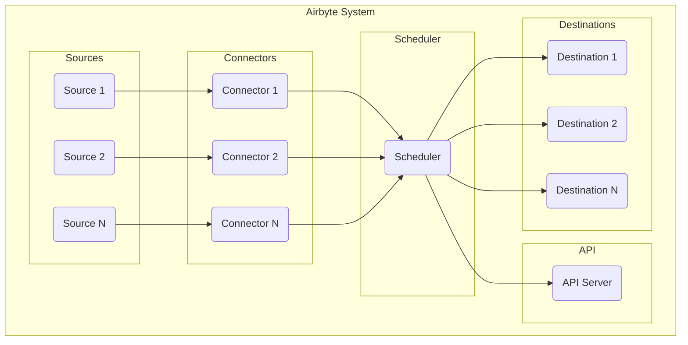
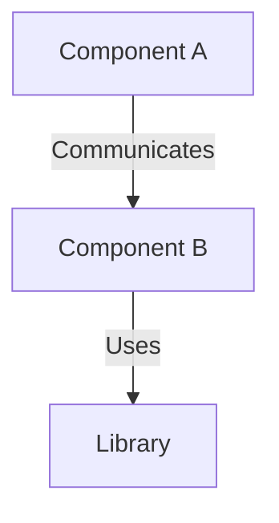
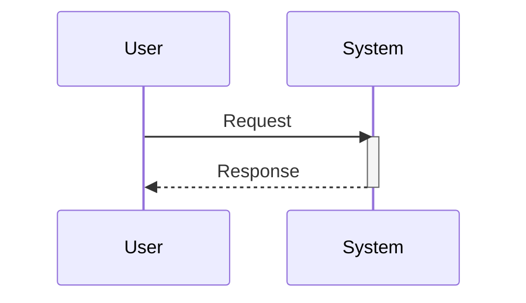

# Software Design 

The design here incorporate  areas that are either being reengineered or extended to enhance the current functionality of several systems  
at spike up, most noticably systems like airbyte , airflow and an operational control center

## Table of Contents

- [Overview](#overview)
- [System Architecture](#system-architecture)
- [Component Diagram](#component-diagram)
- [Sequence Diagram](#sequence-diagram)
- [Installation](#installation)
- [Usage](#usage)
- [Contributing](#contributing)
- [License](#license)

## Overview

- AirByte  
    * Align connector development around low code framework like  Airbyte YAML CDK
    * A path to decomission current source connectors that have significant code foot print 
    * A second level of generalization around YAML connectors on common operations like custom authnetication, specialized request construction  
      and wide format response parsing
    * Component registry build and deployment for wide resuability

- AirFlow
    * Re-engineered DAG's to improve system utilization by collating and parallelizing platform operations 
    * Stage - I Data Quality inspection and control flow of Airflow jobs
    * Better Diagnostics and Error reporting of flows on AirFlow

- Op Control Center

    * Decouple Business Op activity from airbyte connector framework 
    * Data Source Management -- creating new connection, updating and maintaince of source data assets 
    * Dedicated OP control center with near realtime monitoring and activity
    * TO -DO ; more to be added
    
## System Architecture

## Component Diagram

[Create a component diagram using Mermaid.js syntax to represent the major components of your system.]

## Sequence Diagram

[Use Mermaid.js syntax to create a sequence diagram illustrating the interaction between different parts of your system.]

## Installation

[Provide instructions on how to install or set up your software design.]

## Usage

[Explain how to use your software design. Include examples or scenarios.]

## Contributing

[Include guidelines for others to contribute to your software design. This could include information about design reviews or contributions.]

## License

[Specify the license under which your software design is released.]

Feel free to customize this template based on your specific software design and how you want to represent it using Mermaid.js. Include more diagrams or details as needed for your project.